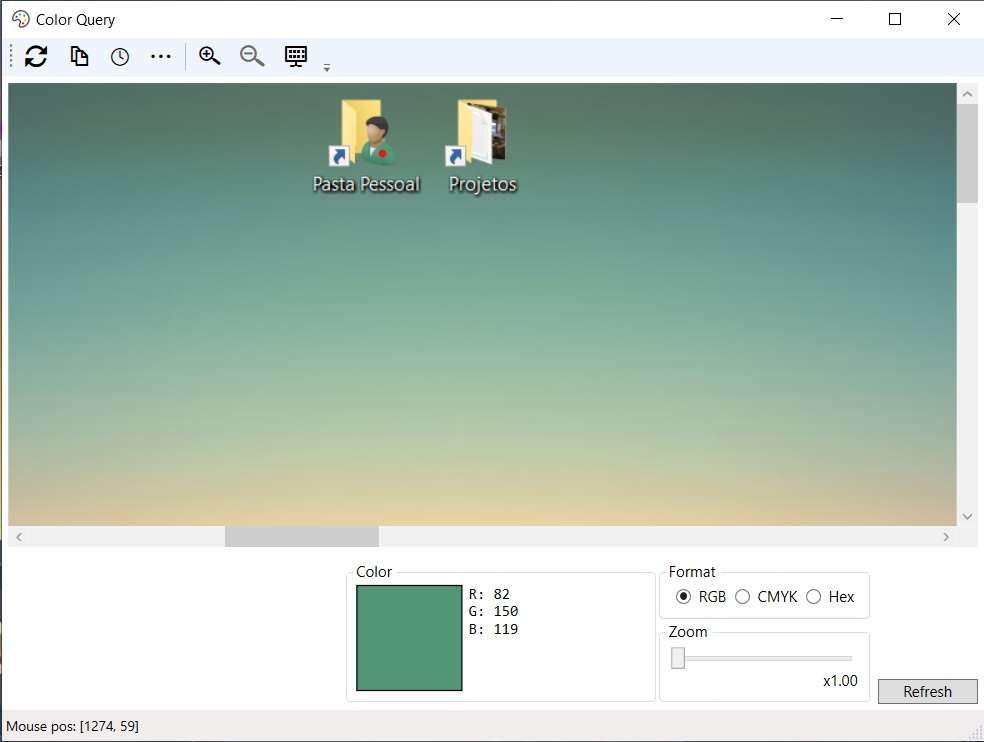

# Color Query

Have you ever wanted to quickly know the color of something, like part of a logo,
the background color of a website or anything in your screen? *Color Query* allows you to do just that.

When *Color Query* opens, it captures a snapshot of what's on your screen.

To get a color, click anywhere in the panel (Shown in red). You will see the color preview below change.

Press `Ctrl+C` to copy the selected color to the clipboard.

To refresh the panel, click the refresh button, or press ´F5´.

## Credits

Icon is from the VS2017 Image Library.