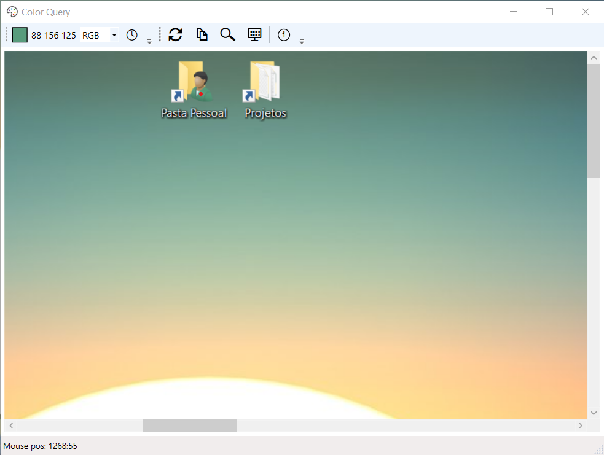

# Color Query

Have you ever wanted to quickly know the color of something, like part of a logo,
the background color of a website or anything in your screen? *Color Query* allows you to do just that.

When *Color Query* opens, it captures a snapshot of what's on your screen.

To get a color, click anywhere in the preview panel (click shown in red). You will see a preview of the color
as well as options to select the format (RGB, HEX or CMYK).

Press `Ctrl+C` to copy the selected color to the clipboard.

To refresh the panel, click the *Refresh* button, or press `F5`.

You can control the zoom by clicking the *Zoom* button, or `Ctrl+MouseWheel`.

## Credits

Icon is from the VS2017 Image Library.